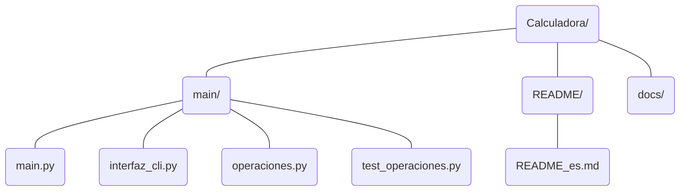

# Calculadora

Calculadora básica de consola desarrollada en Python como proyecto práctico de aprendizaje autodidacta y aplicación de conceptos de programación.

El proyecto está estructurado de forma modular, separando la coordinación de la aplicación, la interacción con el usuario y la lógica de las operaciones matemáticas.

## Características

* Interfaz de usuario mediante consola.
* Menú interactivo de operaciones.
* Adición.
* Sustracción.
* Multiplicación.
* División.
* Potenciación.
* Radicación.
* Soporte para valores enteros y decimales.
* Validación inicial de entradas y situaciones de error.
* Terminología matemática específica para la solicitud de operandos.
* Sistema de pruebas mediante `unittest`, actualmente en desarrollo.

## Estructura



### `main.py`

Actúa como punto de entrada y coordinador de la aplicación. 

Controla el flujo general de ejecución y comunica los diferentes módulos.

### `interfaz_cli.py`

Gestiona la interacción con el Usuario mediante la consola: 

  - Presentación de menú, resultados, mensajes, etc.
  - Entrada de datos.
  - Control de la interfaz.

### `operaciones.py`

Contiene la lógica matemática de la calculadora. 

Cada operación está implementada como una función independiente.

### `test_operaciones.py`

Contiene las pruebas de las operaciones matemáticas mediante la biblioteca estándar `unittest`.

El bloque de testing se encuentra actualmente en desarrollo y será ampliado y adaptado conforme avance el proyecto.

## Tecnologías

* Python
* `unittest` — biblioteca estándar para testing

## Ejecución

Desde el directorio del proyecto:

```bash
python main.py
```

La aplicación mostrará el menú principal y permitirá seleccionar la operación que se desea realizar. 

> Funcionamiento de la vieja escuela (Se implementará GUI conforme al avance de mi formación)

## Objetivo del proyecto

El proyecto tiene como objetivo aplicar de forma práctica conceptos fundamentales de programación en Python, especialmente:

* Modularización.
* Separación de responsabilidades.
* Funciones.
* Control de flujo.
* Gestión de excepciones.
* Entrada y salida de información.
* Testing.

El proyecto continuará evolucionando mediante diferentes versiones y commits, documentando los cambios relevantes durante su desarrollo.
