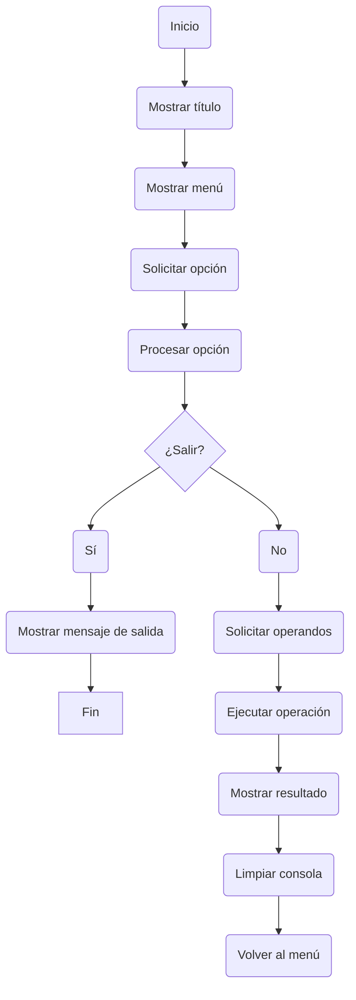
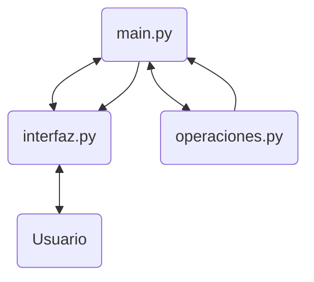

# Calculadora — v 1.0

## 1. Descripción

La versión 1.0 constituye la primera versión funcional de la calculadora desarrollada en Python.

La aplicación funciona mediante una interfaz de línea de comandos (CLI) y permite realizar seis operaciones matemáticas básicas:

* Adición
* Sustracción
* Multiplicación
* División
* Potenciación
* Radicación

La aplicación está dividida en diferentes módulos para separar la interacción con el usuario, la coordinación del programa y la lógica matemática.

---

## 2. Estructura funcional

La versión 1.0 está compuesta por tres archivos operativos principales:

```text
Calculadora/
├── main.py
├── interfaz_cli.py
└── operaciones.py
```

Cada archivo tiene una responsabilidad diferenciada.

| Archivo           | Responsabilidad                                             |
| ----------------- | ----------------------------------------------------------- |
| `main.py`         | Coordinar el flujo de ejecución de la aplicación            |
| `interfaz_cli.py` | Gestionar la interacción con el usuario mediante la consola |
| `operaciones.py`  | Ejecutar las operaciones matemáticas                        |

---

## 3. `main.py`

`main.py` actúa como punto de entrada y coordinador de la aplicación.

Su responsabilidad principal es controlar el flujo de ejecución y determinar qué acción debe realizarse según la opción seleccionada por el usuario.

El flujo general es:



Entre sus funciones principales se encuentran:

* Mantener el ciclo principal de ejecución.
* Procesar la opción seleccionada.
* Determinar qué operación matemática debe ejecutarse.
* Solicitar los operandos mediante la interfaz.
* Enviar los operandos al módulo de operaciones.
* Enviar el resultado a la interfaz para su presentación.

`main.py` no contiene las operaciones matemáticas ni la lógica específica de presentación de la interfaz.

---

## 4. `interfaz_cli.py`

`interfaz_cli.py` concentra la interacción entre la aplicación y el usuario mediante la consola.

Sus funciones se encargan de:

* Mostrar el título de la aplicación.
* Mostrar el menú de operaciones.
* Solicitar y validar la opción seleccionada.
* Solicitar los operandos necesarios.
* Mostrar los resultados.
* Mostrar mensajes de error.
* Mostrar el mensaje de salida.
* Controlar la pausa y limpieza de la consola.

La solicitud de operandos adapta la terminología mostrada al usuario según la operación seleccionada.

Por ejemplo:

| Operación      | Primer operando | Segundo operando |
| -------------- | --------------- | ---------------- |
| Adición        | Sumando         | Sumando          |
| Sustracción    | Minuendo        | Sustraendo       |
| Multiplicación | Factor          | Factor           |
| División       | Dividendo       | Divisor          |
| Potenciación   | Base            | Exponente        |
| Radicación     | Radicando       | Índice           |

La interfaz convierte los operandos introducidos por el usuario a valores de tipo `float`, permitiendo trabajar con números enteros y decimales.

---

## 5. `operaciones.py`

`operaciones.py` contiene exclusivamente la lógica matemática utilizada por la calculadora.

Dispone de seis funciones:

```text
adicion()
sustraccion()
multiplicacion()
division()
potenciacion()
radicacion()
```

Cada función recibe dos operandos, realiza la operación correspondiente y devuelve el resultado.

### División

La función `division()` incorpora una comprobación específica para impedir la división entre cero.

Cuando el segundo operando es `0`, se genera una excepción `ValueError` en lugar de realizar la operación.

### Radicación

La función `radicacion()` calcula la raíz utilizando la relación matemática entre radicación y potenciación:

```text
radicando ** (1 / índice)
```

---

## 6. Relación entre módulos

Los tres módulos trabajan de forma coordinada, manteniendo separadas sus responsabilidades.


El funcionamiento general es:

1. `main.py` solicita a `interfaz_cli.py` la opción del usuario.
2. `interfaz_cli.py` obtiene los operandos.
3. `main.py` determina la operación correspondiente.
4. `main.py` solicita a `operaciones.py` el cálculo.
5. `operaciones.py` devuelve el resultado.
6. `main.py` entrega el resultado a `interfaz_cli.py`.
7. `interfaz_cli.py` muestra el resultado al usuario.

Esta separación permite mantener diferenciadas la interfaz, la coordinación del programa y la lógica matemática.

---

## 7. Funcionalidades de la v1.0

La primera versión funcional permite:

* Iniciar la calculadora desde consola.
* Seleccionar una operación mediante un menú.
* Introducir operandos enteros o decimales.
* Realizar seis operaciones matemáticas.
* Trabajar con valores positivos, negativos y cero en las operaciones compatibles.
* Controlar la división entre cero mediante una excepción.
* Mostrar los resultados mediante la interfaz de consola.
* Repetir operaciones sin reiniciar el programa.
* Finalizar la aplicación mediante la opción `0`.

---

## 8. Limitaciones de la versión

La versión 1.0 constituye una primera implementación funcional y todavía presenta aspectos susceptibles de evolución.

Entre sus principales limitaciones se encuentran:

* Interacción está limitada a la línea de comandos.
* Validación básica de determinadas entradas.
* El tratamiento de errores y excepciones puede ampliarse.
* La radicación no contempla todas las condiciones matemáticas posibles.
* Programa diseñado para las seis operaciones definidas en esta versión.

Estas limitaciones forman parte del estado de la aplicación en la v1.0 y no impiden considerar esta versión funcional dentro de su alcance previsto.

---

## 9. Estado de la versión

**Versión:** 1.0
**Estado:** Primera versión funcional

La v1.0 establece la base funcional de la calculadora y una primera separación de responsabilidades entre los componentes principales de la aplicación.

Las futuras versiones podrán evolucionar a partir de esta base mediante la incorporación de nuevas funcionalidades, mejoras de validación, tratamiento de errores y otras mejoras técnicas.
