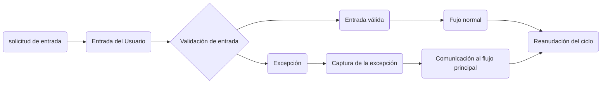
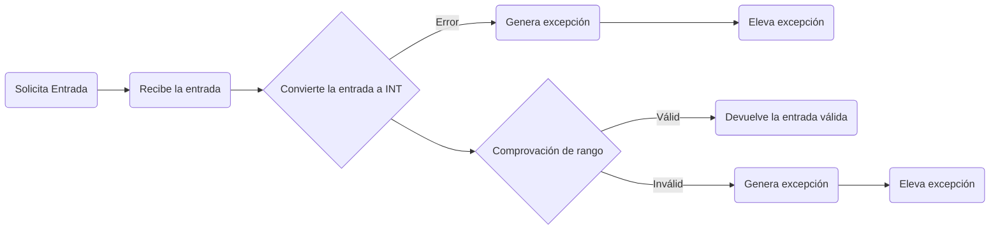
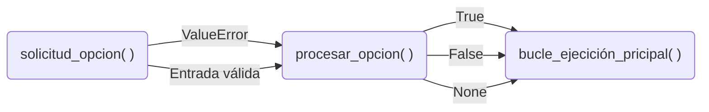

# Calculadora — v1.0.1

## 1. Identificación de la versión

**Versión:** `v1.0.1`

Esta versión se centra en la **gestión de excepciones, la continuidad del flujo de ejecución y la estabilización del comportamiento del programa**.

No se introducen cambios estructurales en la arquitectura general del proyecto.

---

## 2. Problemas encontrados

Durante la revisión y las pruebas del programa se identificaron varios problemas relacionados con la gestión de errores y el control del flujo:

* Algunas excepciones podían propagarse hasta el nivel principal y provocar la interrupción del programa.
* La gestión de una entrada inválida no estaba integrada correctamente en el flujo normal de ejecución.
* La separación de responsabilidades entre la interfaz, el procesamiento de opciones y el bucle principal necesitaba una delimitación más clara.
* El mecanismo utilizado para comunicar al bucle principal qué debía hacer después de procesar una opción podía provocar ambigüedad entre una situación de error y la opción de salida `0`.

Estos problemas no impedían únicamente detectar errores: afectaban a la capacidad del programa para **recuperarse y continuar su ejecución**.

---

## 3. Cambios realizados

Se refactorizaron las funciones relacionadas con la interfaz y el flujo principal para establecer una gestión coherente de las excepciones.

Los principales cambios fueron:

* Captura controlada de las excepciones producidas durante la solicitud de opciones y operandos.
* Comunicación de las situaciones excepcionales hacia el nivel encargado de decidir cómo continuar el flujo.
* Reorganización de `procesar_opcion()` para centralizar la gestión relacionada con la opción seleccionada.
* Reorganización de `procesar_operacion()` para gestionar las excepciones producidas durante la solicitud de operandos y la ejecución de las operaciones.
* Separación entre la decisión sobre el flujo y la ejecución física de `continue` o `break`, que permanece en el bucle principal.
* Mejora de los mensajes asociados a las excepciones para facilitar la identificación de errores durante futuras tareas de mantenimiento.

---

## 4. Diseño de la gestión de excepciones

La gestión de excepciones sigue el principio de que un error representa una desviación del flujo normal y debe ser reencauzado hacia un punto válido de ejecución siempre que sea posible.

El flujo establecido es:

Las funciones que producen una excepción no determinan necesariamente el comportamiento global del programa. La excepción es capturada en el nivel que dispone de la información necesaria para decidir cómo continuar.

### Procesamiento de opciones

`solicitud_opcion()` se encarga de obtener una opción válida:

`procesar_opcion()` gestiona las excepciones relacionadas con esta fase y comunica al bucle principal qué comportamiento debe adoptar.

Actualmente utiliza tres estados:

    True  : Se ha producido una situación excepcional -> reiniciar el ciclo.
    False : Opción válida que conduce al módulo de operaciones.
    None  : Opción de salida -> finalizar el ciclo normalmente.

El bucle principal es quien ejecuta finalmente `continue` o `break`. De esta forma, `procesar_opcion()` decide el resultado del procesamiento sin asumir el control directo del bucle que pertenece a `bulcle_ejecución_principal()`.

### Procesamiento de operaciones

`procesar_operacion()` recibe una opción ya procesada y solicita los operandos correspondientes.

Si la entrada de un operando provoca una excepción:

1. La excepción se captura.
2. Se muestra el mensaje correspondiente.
3. La función finaliza su procesamiento.
4. El bucle principal puede continuar con una nueva iteración.

Las excepciones, por tanto, no se utilizan para finalizar deliberadamente el programa, sino para comunicar una desviación del comportamiento esperado hasta el nivel que puede gestionarla.

---

## 5. Testing

La validación de esta versión se realizó mediante dos mecanismos.

### Testing manual

Se comprobó el funcionamiento completo de la aplicación, incluyendo:

* Selección de las opciones disponibles.
* Ejecución de las operaciones.
* Opción de salida.
* Introducción de operandos válidos.
* Introducción de operandos con formato incorrecto.
* Recuperación del flujo después de producirse una excepción.

El programa mantiene su ejecución después de las situaciones de error contempladas.

### Testing automatizado

Los tests existentes de los módulos `operaciones` e `interfaz_cli` se ejecutan correctamente después de la refactorización.

Esto permite comprobar que las modificaciones realizadas en la implementación mantienen los comportamientos establecidos por los contratos de las funciones.

La continuidad de los tests después de la refactorización confirma que los contratos cubiertos por ellos no han sido alterados.

---

## 6. Estado de la versión

La versión `v1.0.1` queda validada con:

* Funcionamiento general correcto.
* Gestión de las excepciones contempladas.
* Continuidad del flujo después de los errores gestionados.
* Testing manual satisfactorio.
* Tests automatizados de `operaciones` satisfactorios.
* Tests automatizados de `interfaz_cli` satisfactorios.
* Responsabilidades entre interfaz y lógica principal delimitadas.
* Mensajes de error mejorados para facilitar el mantenimiento.

La versión se considera un punto de control estable del proyecto.

---

## 7. Documentación estructural

Los documentos estructurales contenidos en `docs/` no se modifican en esta versión.

Los cambios realizados afectan principalmente al comportamiento, la gestión de excepciones y el control del flujo de ejecución, sin modificar la estructura arquitectónica que define dichos documentos.

La revisión de la documentación estructural queda prevista para la versión `v2.0.0`, asociada a la incorporación de una interfaz gráfica (GUI).

