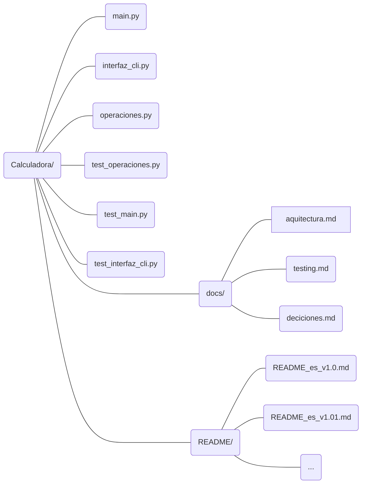
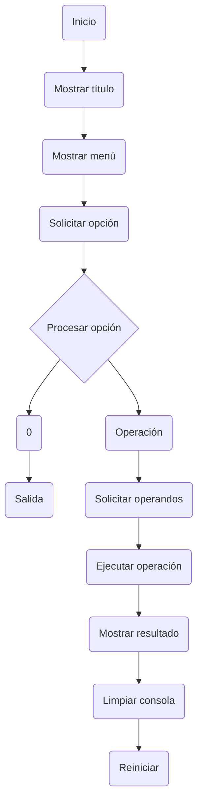
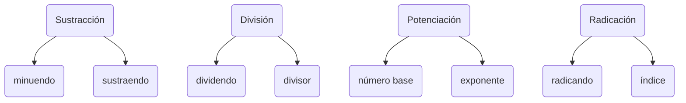
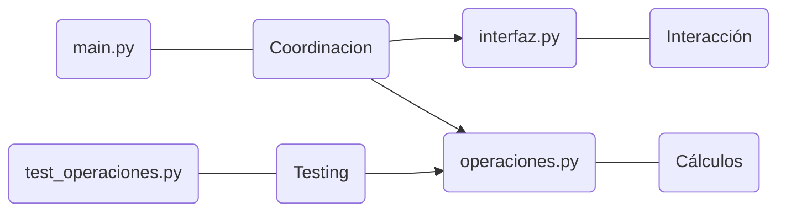
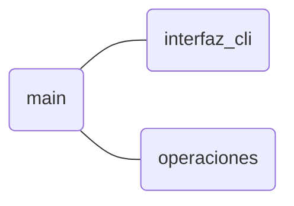
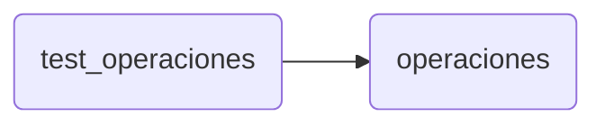
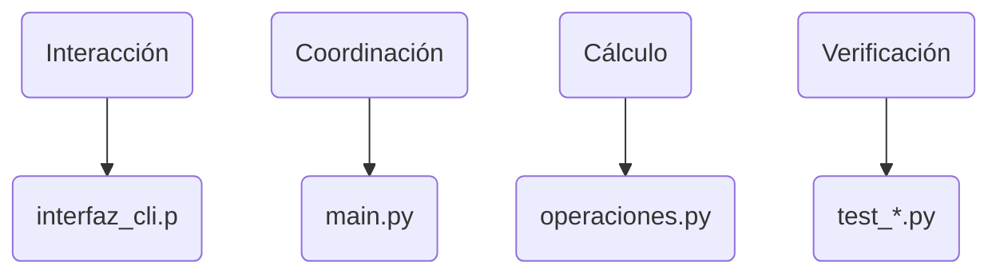

# Arquitectura del proyecto

## 1. Descripción general

La aplicación está estructurada de forma modular, separando tres responsabilidades principales:

* **Coordinación de la aplicación** → `main.py`
* **Interacción con el usuario** → `interfaz_cli.py`
* **Lógica matemática** → `operaciones.py`

El sistema de pruebas se encuentra separado en `test_operaciones.py` y utiliza la biblioteca estándar `unittest`.

La arquitectura busca evitar que la lógica matemática, la interacción con el usuario y el control general de la aplicación queden concentrados en un único archivo.

---

## 2. Estructura




### Responsabilidad de los archivos principales

| Archivo               | Responsabilidad                                   |
| --------------------- | ------------------------------------------------- |
| `main.py`             | Coordinación y control del flujo de la aplicación |
| `interfaz_cli.py`     | Entrada, salida e interacción mediante consola    |
| `operaciones.py`      | Implementación de las operaciones matemáticas     |
| `test_*.py`           | Pruebas automatizadas        |

---

## 3. `main.py`

`main.py` actúa como punto de entrada y coordinador de la aplicación.

Su función principal es controlar el ciclo de ejecución y determinar qué módulo debe intervenir en cada momento.

El flujo general implementado es:


### Funciones principales

#### `bulcle_ejecución_principal()`

Controla el ciclo principal de la aplicación.

Se encarga de coordinar las llamadas a la interfaz y al módulo de operaciones, así como de determinar cuándo finalizar el programa.

#### `procesar_opcion()`

Está destinada al procesamiento de la opción introducida por el usuario y a la gestión de posibles errores asociados a ella.

#### `procesar_operacion()`

Utiliza `match/case` para seleccionar la operación matemática correspondiente y posteriormente delega el cálculo en `operaciones.py`.

---

## 4. `interfaz_cli.py`

Este módulo concentra la interacción con el usuario mediante la línea de comandos.

Su responsabilidad es presentar información y obtener datos.

### Funciones de presentación

* `ver_titulo()`
* `ver_menu()`
* `ver_resultado()`
* `ver_error()`
* `ver_salida()`

Estas funciones se encargan de mostrar información al usuario.

### Funciones de entrada

#### `solicitud_opcion()`

Solicita al usuario la opción del menú y convierte la entrada a `int`.

Además, comprueba que la opción esté dentro del rango permitido:

```Python
0 - 6
```

Cuando la opción no es válida, genera una excepción `ValueError`.

#### `solicitud_operandos()`

Determina primero la terminología que debe utilizarse para solicitar los operandos según la operación seleccionada.

Por ejemplo:



Posteriormente convierte las entradas a `float` y devuelve los dos operandos.

### Control de la consola

`limpiar_consola()` pausa la ejecución hasta que el usuario pulsa Enter y posteriormente ejecuta la orden de limpieza de consola mediante `subprocess`.

---

## 5. `operaciones.py`

Este módulo contiene exclusivamente las operaciones matemáticas de la calculadora.

Cada operación está implementada mediante una función independiente:

```text
adicion()
sustraccion()
multiplicacion()
division()
potenciacion()
radicacion()
```

Las funciones reciben los operandos como parámetros y devuelven el resultado.

### Gestión de errores matemáticos

La división incorpora una validación específica para impedir la división entre cero:

```python
if num2 == 0:
    raise ValueError(...)
```

La excepción se genera en el módulo responsable de la operación matemática, en lugar de trasladar esta validación a la interfaz.

---

## 6. `test_operaciones.py`

El sistema de pruebas está separado de la implementación y utiliza `unittest`.

La clase:

```python
class TestOperaciones(unittest.TestCase):
```

agrupa las pruebas correspondientes a las operaciones matemáticas.

Actualmente existen pruebas para:

* Adición.
* Sustracción.
* Multiplicación.
* División.
* Potenciación.
* Radicación.

Los casos incluyen diferentes combinaciones de valores positivos, negativos, cero y decimales.

También se utilizan diferentes mecanismos de comprobación:

```text
assertEqual()
assertAlmostEqual()
assertRaises()
```

El bloque de testing se encuentra actualmente en desarrollo.

La documentación específica de esta parte se encuentra en `docs/testing.md`.

---

## 7. Comunicación entre módulos

La relación principal entre los módulos puede representarse de la siguiente manera:



La dependencia principal de ejecución es:



Mientras que el módulo de pruebas utiliza directamente `operaciones` para verificar su comportamiento:



---

## 8. Principio de separación de responsabilidades

La estructura actual sigue una separación básica de responsabilidades:



Esto permite modificar una parte del sistema con un impacto más limitado sobre las demás.

Por ejemplo, las operaciones matemáticas pueden probarse directamente sin necesidad de ejecutar la interfaz de consola completa.

---

## 9. Estado actual de la arquitectura

La arquitectura se encuentra en una fase de desarrollo.

La separación de módulos y responsabilidades ya está establecida, pero algunos mecanismos de control y gestión de errores de `main.py` todavía requieren revisión y consolidación.

Por tanto, este documento describe la **estructura y responsabilidades actuales**, no una arquitectura considerada definitiva.

Las modificaciones arquitectónicas relevantes que se realicen durante la evolución del proyecto deberán registrarse en `docs/decisiones.md`.
