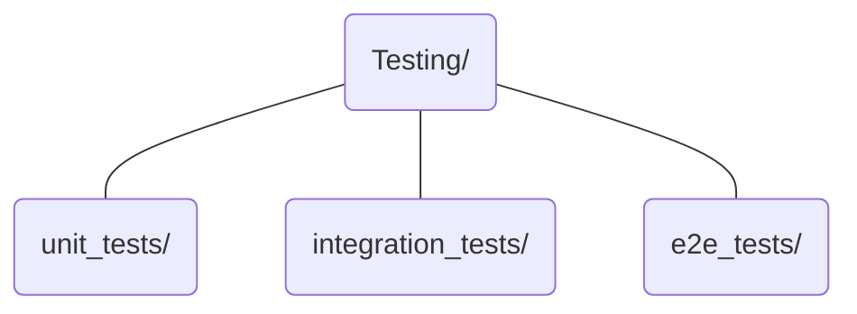
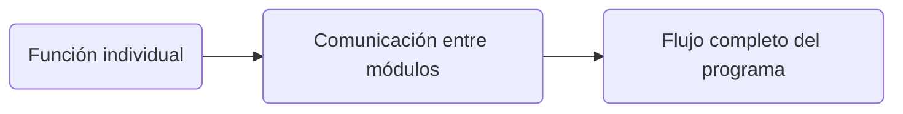
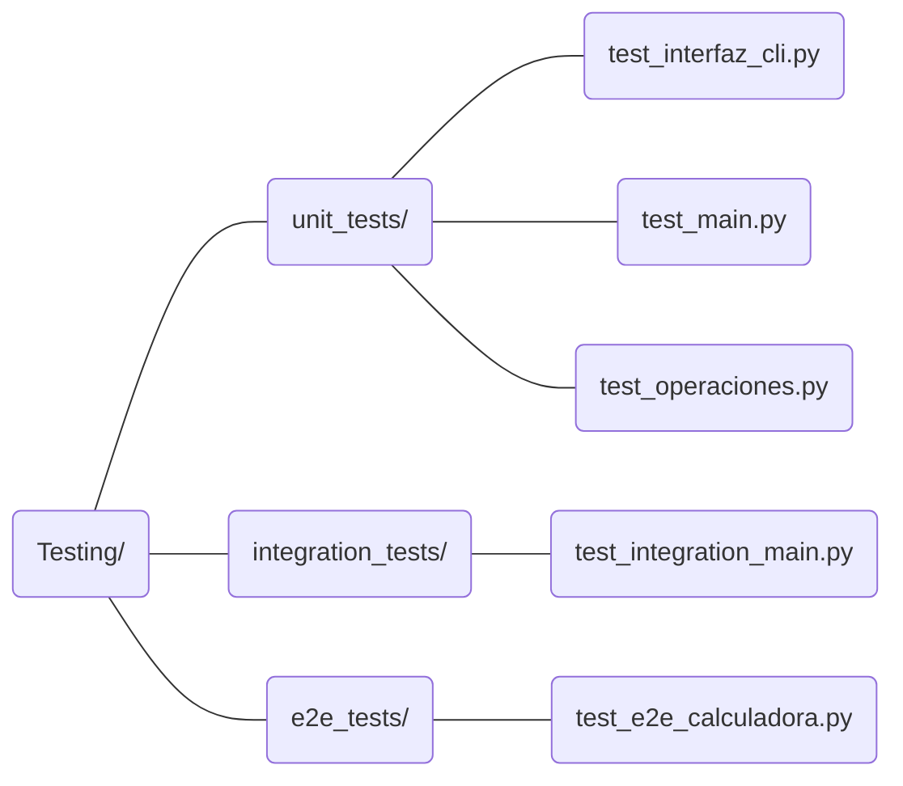

# Testing
## 1. Objetivo

El sistema de *Testing* del proyecto tiene como objetivo verificar el comportamiento de la calculadora mediante pruebas automatizadas organizadas según el nivel de comportamiento que se desea comprobar.

>La estrategia se divide en tres niveles:

* **Testing unitario**: verifica funciones individuales de forma aislada.
* **Testing de integración**: verifica la comunicación y colaboración entre módulos.
* **Testing E2E**: verifica un flujo completo de utilización de la aplicación.

Cada nivel tiene un propósito diferente y se evita repetir innecesariamente las mismas comprobaciones entre ellos.

## 2. Arquitectura de pruebas

Las pruebas se organizan físicamente según su nivel:


Esta separación permite identificar qué aspecto del sistema está verificando cada prueba y facilita su mantenimiento.

### Testing unitario

Comprueba el comportamiento de funciones individuales sin depender de la ejecución real de sus dependencias.

Se utiliza principalmente para verificar:

* Resultados esperados.
* Validaciones.
* Excepciones.
* Diferentes tipos de entrada.
* Comportamientos específicos de cada función.

### Testing de integración

Comprueba que diferentes módulos funcionan correctamente al comunicarse entre sí.

En estas pruebas se mantienen reales las funciones internas que forman parte de la comunicación que se desea verificar.

Las interacciones externas, como la entrada mediante teclado, se simulan para reproducir un comportamiento controlado sin depender de la interacción física del usuario.

### Testing E2E

Comprueba el comportamiento de la aplicación mediante un flujo completo, desde la entrada del usuario hasta la finalización del proceso.

El objetivo no es verificar individualmente cada función, sino determinar si los diferentes componentes colaboran correctamente durante una ejecución completa.

## 3. Criterio de separación

Cada prueba debe situarse en el nivel que corresponda al comportamiento que pretende verificar.

No se utilizan las pruebas de integración o E2E para repetir exhaustivamente los casos ya cubiertos por las pruebas unitarias.

Del mismo modo, una prueba unitaria no debe utilizarse para demostrar que varios módulos funcionan correctamente en conjunto.

La combinación de los tres niveles permite obtener una cobertura progresiva:


## 4. Simulación de dependencias e interacción externa

La simulación se utiliza únicamente cuando resulta necesaria para aislar el comportamiento que se desea comprobar o para reproducir una interacción externa de forma controlada.

En las pruebas unitarias se pueden sustituir dependencias mediante las herramientas de `unittest.mock`.

En las pruebas de integración y E2E se mantienen reales los componentes internos que forman parte del comportamiento evaluado. Las entradas externas, como `input()`, se simulan para reproducir las acciones del usuario sin intervención manual.

## 5. Organización

El proyecto utiliza `unittest` como framework de pruebas.

Los archivos de prueba se agrupan por nivel:


Los detalles específicos de cada nivel se documentan en:

* UnitaryTesting_es.md
* IntegrationTesting_es.md
* e2eTesting_es.md

## 6. Ejecución

El conjunto completo de pruebas puede ejecutarse mediante el sistema de descubrimiento de `unittest`:

```Python
python -m unittest discover -s Testing -p "test_*.py" -v
```
También es posible ejecutar individualmente los diferentes módulos de prueba cuando se necesita analizar un comportamiento concreto.

## 7. Estado actual

La batería actual contiene 17 pruebas automatizadas distribuidas entre los tres niveles.

El conjunto completo ha sido ejecutado mediante `unittest` y actualmente todas las pruebas superan las comprobaciones definidas:

    Ran 17 tests

    OK

La batería de pruebas representa el estado funcional actual de la calculadora. 

Cualquier modificación relevante de la implementación deberá acompañarse de la revisión o ampliación de las pruebas correspondientes.