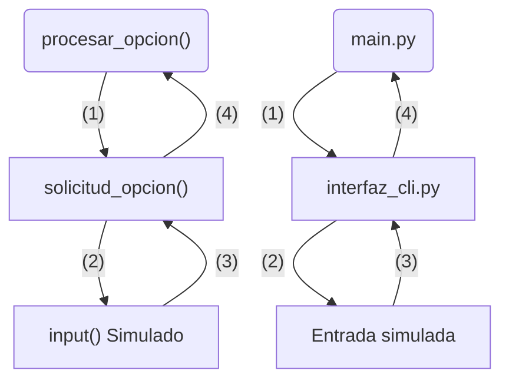
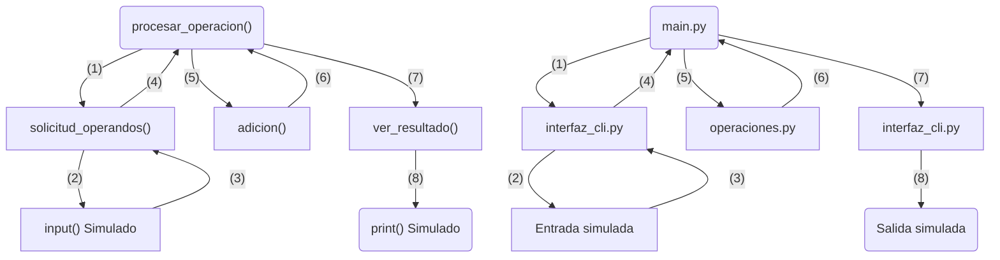

# Pruebas de integración

## 1. Objetivo

Las pruebas de integración verifican que los módulos de la aplicación se comunican correctamente entre sí.

A diferencia de las pruebas unitarias, las funciones internas que participan en la comunicación permanecen reales. Solo se simulan las interacciones externas necesarias para reproducir el comportamiento de forma controlada.

## 2. Organización

Las pruebas de integración se encuentran en:

```text
Testing/
    integration_tests/
        test_integration_main.py
```

Actualmente se utilizan dos pruebas para verificar las principales comunicaciones del flujo de la aplicación.

## 3. Integración de `procesar_opcion()`

La primera prueba verifica la comunicación entre `main.py` e `interfaz_cli.py`.

El flujo comprobado es:


Se simula únicamente `input()` para representar una entrada del usuario.

La función `solicitud_opcion()` permanece real para comprobar que `procesar_opcion()` recibe y procesa correctamente la opción proporcionada por `interfaz_cli`.

## 4. Integración de `procesar_operacion()`

La segunda prueba verifica la comunicación entre los módulos implicados en el procesamiento de una operación.

Se utiliza una operación de suma como caso representativo.

El flujo comprobado es:


La prueba no sustituye las funciones internas de `interfaz_cli.py` ni `operaciones.py`.

El objetivo es comprobar que los módulos colaboran correctamente para recibir los operandos, ejecutar la operación y presentar el resultado.

## 5. Criterio de cobertura

No se repiten las seis operaciones matemáticas en las pruebas de integración.

Las operaciones individuales ya se comprueban mediante las pruebas unitarias de `operaciones.py`.

En integración basta un caso representativo para verificar que la comunicación entre los módulos funciona correctamente.

Este criterio evita utilizar las pruebas de integración para repetir comprobaciones que pertenecen al nivel unitario.

## 6. Estado actual

Actualmente existen dos pruebas de integración y ambas superan las comprobaciones definidas.

Estas pruebas forman parte de la batería general de 17 pruebas automatizadas del proyecto.
